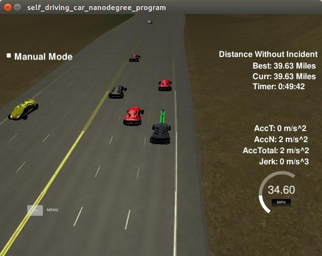

# CarND-Path-Planning-Project
Self-Driving Car Engineer Nanodegree Program

## Code compilation

The only external library I used is "spline.h". All of my coding resides within "main.cpp", and some constants are defined in "constants.h".

## Valid trajectories

### Full lap around the circuit

The following screenshot shows how the car completed over a full lap:

### Speed control

The control implemented sets a target speed for each possible lane, and tries to adapt the car speed to this target without exceeding the limits on acceleration and jerk.

See code lines 566-575.

To choose the fastest speed for a lane, the control is going to check for cars ahead of ego in that lane. Depending on the distance to those other car and what is considered to be a _safe_ distance, the target speed is chosen. This speed will always have to be lower than the maximum allowed speed for the route (50mph).

If the nearest car ahead of ego is further away than the safety distance, maximum speed is allowed.

If ego is invading the safety distance, speed will be chosen proportional to that distance. This means that after a while, ego will be driving the same speed as the car in front of him, respecting the safe distance.

Safe distance is defined as the distance covered in a fraction of time driving at the other car's speed. The fraction of time to consider a safe distance is set in lines 15-16 of "constants.h".

There is a very basic speed controller in lines 711-719 which adjust speed while staying within the limits for acceleration and jerk. To do this, there is a constant limiting maximum acceleration, defined in line 6 of constants.h.

### Max Acceleration and Jerk

The previous entry covered the basics to stay within acceleration and jerk limits.

The other critical point is acceleration and jerk while changing lanes. For this case where the most complex maneuvers are lane changes, a profile of lane change is defined in line 648. The path planner is setting points for the spline along a 100m long s distance (see line 564) with a lateral movement along d (see lines 606-614).

The variable *p_lateral* in line 648 sets the portion of *advance_d* to cover with step in *advance_s*. The default values define a soft lane change. If there is no lane change, all values are set to 1.0, meaning an inmediate correction. Since corrections to stay in line are always small, this allows the car to keep the lane while not creating big accelerations.

Furthermore, to give ample margin to the lateral movements, linear maximum acceleration is halved while changing lanes (see line 718).

### Collisions

To stop collisions, the first measure is speed control regarding cars ahead of us, as explained in previous headings.

The second measure, is the logic that allows lane changes in lines 584-602. The conditions to allow a lane change are a mixture of safety and profit:
1. The lane speed must be the fastest of all.
2. If two lanes have the same fastest speed, the chosen lane must have the longest free runway (i.e. the next car in the lane is the furthest away).
3. The car ahead in the lane is further away than the safety distance (measured in a fraction of time times their driving speed, as explained earlier).
4. The car behind in the lane must be at least a minimum distance away which is fixed in line 16 of "constants.h"

There are rare events where a car will be pulling from behind very fast but at the time of deciding to change lines will respect the safety minimum. We will perform the lane change and the other car will not have enough time to stop. This could be protected against setting this fixed safety minimum to a variable distance, like done for the safety distance ahead. One would choose a fraction of time as the safety, and multiply it with the speed difference between ego's speed in that lane and the speed of the vehicle behind.

### Staying in the lane

As explained in the paragraph for Acceleration and Jerk, when there are no lane changes planned ego applies immediate corrections to keep the lane.

I had to improve both coordinate conversion functions:

- _getXY_ to convert from frenet to cartesian, my improved function is _getXYspline_

- _getFrenet_ to convert from cartesian to frenet, my function is _getFrenetS_

These two functions were *essential* to be able to complete the project respecting acceleration and jerk limits. They provide much better results than the original ones.

*However* the simulator appears to use also some inexact functions and it is specially noticeable around s coordinates 4800 to 5200 while driving the external lane. It kept flagging my car as driving outside the lane in this section, while it was perfectly following the highway. To stop this from happening I had to include lines 608-614 which adjust the target while in this s range and outmost lane.

### The car is able to change lanes

The logic for changing lanes is built in lines 578-603.

Ego looks left and right and choses the fastest lane. A lane change is only allowed if current path contains points only in one lane (see lines 462-474) and if the current path is small (under 25 points planned).

## Reflection

I spent countless hours trying to implement the most basic examples of JMT shown in the course. None of them worked because of the faulty coordinate conversion functions provided with the example code.

By the time I realized that this was the real problem, I had already changed the paradigm to doing something "like the tutorial" and burned too many hours (Over one month on this project). Realistically I had no chance but to fix those coordinate change functions and finish the project along the current path, which has none of the finesse and coolness taught during the course and which I wanted to implement (see files "pathplanner.cpp", "pathplanner.h", "trajectory.cpp", "trajectory.h" for the work I had started on a behavior planner class and a JMT trajectory evaluator).

Now, this project does not show the same cool behavior planner as taught in class, but it nonetheless is able to determine a good path of action for the given conditions (Highway driving). The screenshot at the beginning of the report shows the car driving unimpeded for the time it took me to write the report. While it lacks the ability to devise complex behavior combinations, the logic has been covered in the previous section allows satisfactory driving: it respects safety, it tries to be fast, and to look ahead for intelligent lane changes.
